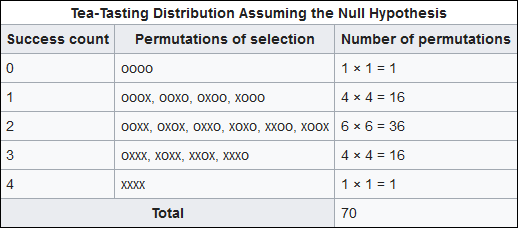
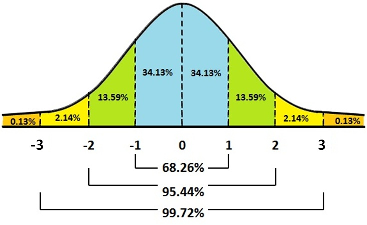
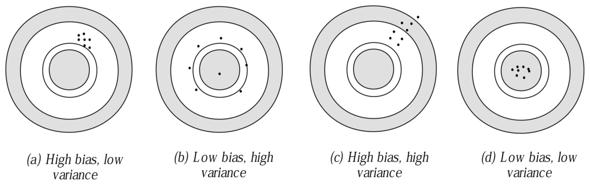
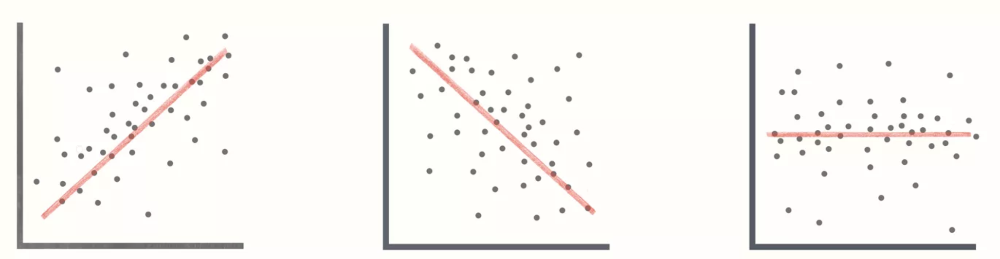

```{r message=FALSE, warning=FALSE, include=FALSE, results='hide'}
library(tidyverse)
library(here)
```

## Programa

- Amostragem
- Inferência
- Estimação: pontual e intervalar
- Associação e Causalidade
- Condições para causalidade
- Modelagem
- Regressão

## Motivação

Nas eleições de Julho de 1932, o Partido Nazista se transformou na maior bancada do 
Parlamento alemão (ainda que não tenha ganho maioria). Quem os elegeu? Como podemos 
entender os valores desses eleitores por meio de pesquisas amostrais? E como podemos 
fazer comparações precisas sobre os grupos que demonstraram maior apoio ao partido?

## Amostragem

## Amostragem
Em um dos [relatórios de pesquisa](http://media.folha.uol.com.br/datafolha/2018/10/26/3416374d208f7def05d1476d05ede73e.pdf) 
do Datafolha para as eleições do ano passado, lemos a seguinte frase:

<center>

</center>

Para entender o que quer dizer isso (e por que essa descrição está errada), precisamos 
falar de amostras, estimação e incerteza.

## Como selecionar a amostra?
Toda inferência depende dos dados coletados e de um conjunto de suposições. Uma das 
suposições mais importantes é a de que a **amostra é aleatória**, ou seja, todos os 
indivíduos têm a mesma probabilidade de ser selecionado.

Parece uma coisa simples, mas conseguir uma amostra aleatória de verdade é mais difícil 
do que aparenta. Na prática, é raríssimo fazer uma amostra aleatória simples, e algumas 
técnicas são adotadas para selecionar amostras *como se fossem* aleatórias. Não vamos 
entrar em detalhes aqui, mas podemos destacar duas famílias de técnicas bastante utilizadas.

## Amostras na prática

- Pré-estratificação: as observações são selecionadas de modo a cumprir proporções 
equivalentes àquelas encontradas na população

- Pós-estratificação: As observações são ponderadas de modo a aumentar a influência 
de estratos subrepresentados na amostra e diminuir a influência de estratos sobrerepresentados

Qual é a desvantagem dessas técnicas?

## Tamanho da amostra não depende da população!
Note que as fórmulas para definir o tamanho da amostra são

$$n = \sigma^{2} \left(\frac{z}{M} \right)^{2}$$

$$n = \pi(1 - \pi) \left(\frac{z}{M} \right)^{2}$$

O tamanho da população não influencia o tamanho da amostra. O que a define são o 
nível de confiança, a estimativa intervalar e a dispersão da variável 

## Uma Senhora Toma Chá...

Uma senhora inglesa, grande apreciadora de chá com leite (sim, eu sei), dizia ser 
capaz de identificar se o chá foi colocado antes ou depois do leite na mistura. Segundo ela, 
a mistura só ficava boa se o leite era posto antes do chá. Mas será que ela sabe mesmo identificar?

- Se a gente der apenas uma xícara para testar o conhecimento dela, ela pode acertar 
por sorte (50% de chance)
- Se dermos mais xícaras, como identificar se a proporção de acertos dela é 
indestinguível da sorte?

Fisher preparou 8 xícaras, alternando entre chá antes do leite e leite antes do chá. Ela 
deveria pegar 4 dessas xícaras e dizer o que foi posto antes.

## Uma Senhora Toma Chá...
Assumindo que ela estivesse chutando:

- A chance de acertar os 4 resultados é de 1,4% (1/70)

- A chance de acertar 3 resultados é 22,8% (16/70)

<center>

</center>

Como distinguir se ela está chutando ou se realmente consegue identificar corretamente as bebidas?

## Uma Senhora Toma Chá...

<center>
{width=200px}
</center>

## Inferência

## Inferência
A motivação mais comum para o uso de estatística nas ciências sociais é fazer inferências 
com base em amostras. A ideia é que, para saber uma característica qualquer da população, 
podemos observar alguns casos e seguir algumas regras de estimação.

A diferença mais importante entre a estatística inferencial e a estatística descritiva 
é que, na primeira, nosso objetivo é **calcular e comunicar incerteza**. Não fazemos 
inferência estatística para *descobrir* qual é o valor de um parâmetro; fazemos inferência 
para dar um palpite razoável sobre esse valor, com cálculo preciso da incerteza.

Vamos ver alguns conceitos.

## Probabilidades na curva normal (regra empírica)
- Distribuição normal é simétrica
- Pode ser inteiramente descrita com dois parâmetros: média e desvio-padrão
- Comum na natureza, também é bastante usada nas ciências sociais devido ao Teorema Central do Limite

<center>
{width=500px}
</center>

## Distribuição de amostras
- Em ciências sociais, quase nunca as distribuições são normais
- Muitas vezes, não sabemos como se comporta a distribuição real
- Podemos usar amostras para fazer inferências sobre os parâmetros da distribuição
- As estatísticas dessas amostras, quando obtidas repetidamente, seguem uma distribuição repetida
- Não estamos mais falando de distribuição de valores de uma variável, mas de estatísticas 
que emergem de diversas amostras
- Exemplo: como se comporta a distribuição da intenção de votos em uma eleição?

## Distribuição de amostras
- Se fizermos diversas amostras de uma mesma população, podemos esperar variabilidade 
nos resultados
- **Esse erro é inerente ao fato de que estamos utilizando apenas uma parte da população**: a amostra
- Por isso institutos de pesquisas têm números diferentes para uma eleição. Mas essa 
variação segue um padrão conhecido
- Na prática, não precisamos tirar diversas amostras: podemos calcular o **erro padrão**

<center>
<span class="red">
Erro padrão é o erro que esperamos obter se fizermos diversas amostras de uma mesma população
</span>
</center>

## Teoremas fundamentais
Você pode ser perguntar: se estamos fazendo apenas uma pesquisa, como sabemos que o 
valor dela representa um palpite razoável sobre o parâmetro?

- [Lei dos Grandes Números](https://seeing-theory.brown.edu/basic-probability/index.html#section2): A média 
amostral converge para o valor esperado da distribuição à medida em que o n cresce. Exemplo: jogar dados repetidas vezes
- [Teorema Central do Limite](https://seeing-theory.brown.edu/probability-distributions/index.html#section3): A distribuição 
amostral da média se aproxima de uma normal, independentemente da distribuição original da variável

## Simulação - Lei dos Grandes Números
```{r echo=FALSE, cache=TRUE, fig.align="center", fig.height=5, message=FALSE, warning=FALSE}
library(ggplot2)
library(gganimate)
library(dplyr)
library(gifski)

# Para replicar a simuação
set.seed(1234)

n <- 500 # número de jogadas
p_cara <- .5 # probabilidade teórica  de sair cara

# Simulação das jogadas 
simul <- sample(x = c(0,1),
               prob = c(1 - p_cara, p_cara), 
               size = n, 
               replace = TRUE)

r <- cumsum(simul) # soma acumulada
n <-  1:n
v_esperado <- r/n # probabilidade de cara em cada jogada

# Jogando a simulação em um banco de dados 
bd <- data.frame(jogada = 1:500, prop = v_esperado)

# Animação
ggplot(bd, aes(x = jogada, y = prop, frame = jogada)) +
  geom_path(aes(cumulative = TRUE), size = 1) + xlim(1, 500) + ylim(0.0, 1.0) +
  geom_hline(yintercept = 0.5, color = "red", linetype = "dashed") +
  ggtitle("Proporção de caras quando jogamos uma moeda") +
  ylab(NULL) +
  xlab("Jogadas") +
  theme_classic() +
  transition_reveal(jogada)

```


## Não confunda!

- Distribuição da população **vs** distribuição dos dados amostrais **vs** distribuição amostral
- Desvio-padrão **vs** erro padrão
- Número de amostras **vs** número de observações

## Estimação

## Estimação pontual e intervalar

Como fazer a ponte entre os dados que coletamos em nossa amostra e o valor verdadeiro 
do parâmetro populacional? Como comunicar a incerteza?

- **Estimativa pontual**: o melhor palpite que podemos dar sobre o valor do parâmetro
- **Estimativa intervalar**: um intervalo de valores dentro do qual acreditamos que o parâmetro se encontra

## Aplicação: World Values Survey
O [World Values Survey](https://www.worldvaluessurvey.org/) é um projeto que faz 
pesquisas de opinião representativas em diversos países, entre eles o Brasil.

As perguntas são padronizadas, de modo a facilitar a comparação. São avaliadas as 
percepções das pessoas sobre assuntos como instituições políticas, capital social, 
religião e valores pós-materialistas.

Vamos criar um objeto `wvs` com os resultados da última onda:

```{r echo=TRUE, results='hide'}
wvs <- readRDS(here("./data/EVS_WVS_Cross-National_Wave_7_joint_core_R_v1_1.rds"))

table(wvs$C_COW_ALPHA) # n de entrevistas em cada país
```

## Confiança nas instituições
Usando os dados do WVS, podemos estimar a confiança dos brasileiros em suas instituiições políticas. Vamos utilizar o seguinte bloco de perguntas:

<center>
{width=600}
</center>

## Confiança nas instituições
Qual é o percentual de pessoas que confia em partidos políticos no Brasil?

```{r echo=TRUE, results='hide'}
partidos <- wvs %>% 
  select(C_COW_ALPHA, A_YEAR, Q72) %>% 
  filter(C_COW_ALPHA == "BRA") %>% 
  mutate(confia_em_partidos = case_when(Q72 %in% c(1, 2) ~ 1,
                                        TRUE ~ 0)) %>% 
  summarise(soma_confiam = sum(confia_em_partidos), 
            total_entrevistados = n(),
            prop = round(soma_confiam/total_entrevistados * 100, 2))

estimativa <- prop.test(partidos$soma_confiam, partidos$total_entrevistados, .5)
   
```
Resposta: Nesta amostra, apenas `r round(estimativa$estimate*100, 1)`% dos brasileiros 
confiavam nos partidos políticos em 2018. Se repetíssemos essa pesquisa infinitas vezes, 
95% das médias estariam entre `r round(estimativa$conf.int[1]*100, 1)`%  e `r round(estimativa$conf.int[2]*100, 1)`% 

## Propriedades dos estimadores
<center>
{width=800px}
</center>

##  Comunicando incerteza
Lembre-se de que não estamos olhando para toda a população. Tão importante quanto 
identificar qual é o “melhor palpite” sobre o valor do parâmetro é comunicar seu grau de 
incerteza em relação à estimativa.

- **Intervalo de confiança**: estimativa intervalar, calculada pelo pesquisador durante a análise
- **Nível de confiança**: <span class="red">definido</span> pelo pesquisador antes da análise dos dados
- **Margem de erro**: erro-padrão multiplicado pelo número de desvios-padrões que produzem o nível de confiança definido
previamente pelo pesquisador

<center>
**intervalo de confiança = estimativa pontual ± m. de erro**
</center>

## Exercício

Identifique o país com maior nível de confiança na ONU, e construa o intervalo de 95% em torno da média.

## Exercício: resposta
<!---
```{r message=FALSE, warning=FALSE}

onu <- wvs %>% 
  select(C_COW_ALPHA, A_YEAR, Q83) %>% 
  mutate(confia_na_onu = case_when(Q83 %in% c(1, 2) ~ 1,
                                        TRUE ~ 0)) %>% 
  group_by(C_COW_ALPHA) %>% 
  summarise(soma_confiam = sum(confia_na_onu), 
            total_entrevistados = n(),
            prop = round(soma_confiam/total_entrevistados * 100, 2)) %>% 
  arrange(desc(prop)) %>% 
  slice(1)

prop.test(onu$soma_confiam, onu$total_entrevistados, .5)

```
--->

## Trade-off entre nível de confiança e intervalo de confiança
<center>
{width=800px}

[Uma simulação ilustrativa](http://rpsychologist.com/d3/CI/)
</center>

## Em resumo

## Amostragem e inferência
Retomando:

- O primeiro passo é deixar de pensar em distribuição dos dados e passar a pensar 
em **distribuiçao amostral**
- Distribuição amostral é uma distribuição de *estatísticas*, em vez das distribuições 
de observações com as quais estamos habituados
- O [Teorema Central do Limite](https://seeing-theory.brown.edu/probability-distributions/index.html#section3) mostra 
**convergência em distribuição**: qualquer que seja a distribuição original das observações, suas 
médias convergem para a distribuição Normal
- A [Lei dos Grandes Números](https://seeing-theory.brown.edu/basic-probability/index.html#section2) mostra 
**convergência pontual**: com n grande o suficiente, as estimativas convergem para o valor 
verdadeiro na população

## Em inferência, é muito importante comunicar incerteza!

Inferência é um **palpite bem informado** sobre o valor do parâmetro, condicionado 
a algumas suposições. Não basta falar qual é o seu palpite, é fundamental comunicar 
com clareza quão certo você está dele!

- <span class="red">Estimativa pontual</span> é o melhor palpite que podemos dar 
sobre o valor do parâmetro. Sua representação mais comum é a **média**
- <span class="red">Estimativa intervalar</span> é um conjunto de valores que consideramos 
palpites razoáveis. Quanto mais largo o intervalo, maior nossa incerteza. Geralmente é 
representado pelo **intervalo de confiança** ou pela **margem de erro**
- <span class="red">Nível de confiança</span> é um valor definido *a priori*, que traduz 
qual é o grau de incerteza que estamos dispostos a aceitar em nosso palpite

## A leitura no nosso primeiro exemplo faz sentido?
Datafolha em 2014: 

<center>
{width=900px}
</center>

Datafolha em 2018: 

<center>
{width=900px}
</center>

## Associação e causalidade

## Associação
Lembram da variância?

$$
\sigma^{2} = \sum_{i=1}^{n}\frac{(x_{i} - \bar{x})^{2}}{N} = \sum_{i=1}^{n}\frac{(x_{i} - \bar{x}) * (x_{i} - \bar{x})}{N}
$$

Dizemos que duas variáveis estão associadas quando elas **variam conjuntamente**, tanto 
faz se na mesma direção ou em direções diferentes. Quando não há variação em uma das 
variáveis, não conseguimos, do ponto de vista estatistico, avaliar se há 
associaçao. **Variação é informação!**

$$
cov(x, y) = \sum_{i=1}^{n}\frac{(x_{i} - \bar{x}) * (y_{i} - \bar{y})}{N}
$$

## Correlação
O coeficiente **r de Pearson** é uma medida específica de associação, a mais conhecida 
entre diversas outras. É uma medida de covariância padronizada, de modo que os valores 
sempre são restritos entre -1 e 1. Esse coeficiente é linear por construção, e vai tentar 
traçar uma reta mesmo que a nuvem de dados tenha um formato não linear.

$$
r = \sum_{i=1}^{n} \frac{cov(x,y)}{\sigma_{x}\sigma_{y}}
$$

## Correlação
<center>
{width=900px}
</center>

## Correlação
Quando encontramos associação entre duas variáveis, não conseguimos distinguir se:

- $X$ influencia $Y$
- $Y$ influencia $X$
- $X$ e $Y$ se influenciam mutuamente
- $Z$ influencia $X$ e $Y$ (variável omitida)

## Correlação não é causalidade
<center>
{width=900px}
[Exemplos de correlações espúrias](https://www.tylervigen.com/spurious-correlations)

</center>

## Correlação não é causalidade
Para concluir que

$$X \longrightarrow Y$$

precisamos estabelecer três condições:

- **Ordem temporal**: $Y$ não pode acontecer antes de $X$. É a condição de mais 
fácil verificação.
- **Associação**: $X$ e $Y$ devem variar mutuamente. Avaliada com as ferramentas 
que vimos até agora no curso.
- <span class="red">**Eliminação de alternativas**</span>: todas as outras explicações 
plausíveis para $Y$ são descartadas. É a condição mais difícil de verificar.

## Regressão: modelagem e especificação

## *Del Rigor en la Ciencia*

En aquel Imperio, el Arte de la Cartografía logró tal Perfección que el mapa de una sola Provincia ocupaba toda una Ciudad, y el mapa del Imperio, toda una Provincia. Con el tiempo, estos Mapas Desmesurados no satisficieron y los Colegios de Cartógrafos levantaron un Mapa del Imperio, que tenía el tamaño del Imperio y coincidía puntualmente con él.

Menos Adictas al Estudio de la Cartografía, las Generaciones Siguientes entendieron que ese dilatado Mapa era Inútil y no sin Impiedad lo entregaron a las Inclemencias del Sol y los Inviernos. En los desiertos del Oeste perduran despedazadas Ruinas del Mapa, habitadas por Animales y por Mendigos; en todo el País no hay otra reliquia de las Disciplinas Geográficas.

Suárez Miranda, Viajes de Varones Prudentes, Libro Cuarto, Cap. XLV, Lérida, 1658.

--- Jorge Luis Borges ([wiki](https://pt.wikipedia.org/wiki/Jorge_Luis_Borges))


## Modelagem
<center>
> All models are wrong, but some are useful.
> 
> --- George Box

{width=600px}
</center>

## Afinal, o que significa "modelar" os dados?
Vamos começar com uma premissa bastante simples: para modelar, precisamos explicitar 
quais são as condições sob as quais uma variável $X$ se relaciona com uma variável $Y$. 
Para fins de nomenclatura, vamos começar a dar nomes específicos para essas variáveis:

- **Variável Dependente (VD)**: é o nosso fenômeno de interesse, usualmente denotada como $Y$
- **Variável Independente (VI)**: é o fenômeno que explica nossa variável dependente, 
que geralmente denotada como $X$

## Afinal, o que significa "modelar" os dados?
Matematicamente, vamos modelar $Y$ como uma *função* de $X$. Estatisticamente, a 
modelagem geralmente pode servir para dois objetivos principais:

1. **Predição**: usada para investigar a possibilidade de usar os valores de $X$ para 
prever o valor de $Y$. Não precisa haver uma conexão substantiva entre essas duas variáveis, 
contanto que uma sirva para gerar previsões confiáveis sobre os valores de outra. 
2. **Explicação**: usada para entender a conexão e a significância (substantiva e estatística) 
da relação entre duas variáveis. Neste caso, queremos estimar com precisão o impacto de uma variável 
sobre a outra, de preferência excluindo as possíveis variáveis omitidas.

## Modelo linear

O modelo OLS permite verificar a associação entre dois fenômenos mantendo constantes 
outras explicações possíveis, que chamamos de variáveis de controle. Trata-se de um **modelo linear**, 
mas veremos como flexibilizar essa suposição logo mais. Por enquanto, cabe lembrar 
que a forma funcional da regressão nada mais é do que uma equação:

$$y = \beta{_0} + \beta{_1} x{_1} + \ldots + \beta{_k} x{_k} + \epsilon$$

## Modelo linear
Nessa equação, os valores de $y$ e de $x_{1} \ldots x{_k}$ são conhecidos, e os 
valores de $\beta_{0} \ldots \beta_{k}$ são as incógnitas. Quando temos apenas uma 
variável independente, podemos estimar o valor de $\beta$ de maneira simples:

$$\hat{\beta} = \frac{\sum_{i=1}^{n}(x_{i} - \bar{x})(y_{i} - \bar{y})}{\sum_{i=1}^{n}(x_{i} - \bar{x})^{2}}$$

Geralmente, porém, temos um conjunto de variáveis independentes, com muito mais incógnitas. 
Nesses casos, precisamos resolver um sistema de equações:

$$\boldsymbol{\hat{\beta}} = (X^{\prime}X)^{-1}X^{\prime}y$$


## Eleições de 1932 na Alemanha

Vamos analisar as eleições de 1932 na Alemanha, na qual o Partido Nazista conseguiu 
pela primeira vez se transformar no maior partido da República de Weimar. 

```{r message=FALSE, warning=FALSE}
nazis <- read_csv(here("./data/nazis.csv"))
```
Nosso banco de dados tem as seguintes variáveis:


## Eleições de 1932 na Alemanha
Vamos começar estimando o seguinte modelo:

$$\widehat{nazi} = \beta{_0} + \beta{_1}* prop\_desempregados + \epsilon$$
```{r echo=TRUE, fig.show="hide", message=FALSE, warning=FALSE, results='hide'}
library(jtools) # pacote com ferramentas de visualização de modelos

m1 <- lm(nazivote ~ shareunemployed, data = nazis) # rodando o modelo

summ(m1, confint = TRUE) # tabela de resultados

plot_summs(m1, scale = TRUE) # gráfico com resultados
```

Como interpretar o resultado?

## Eleições de 1932 na Alemanha
Podemos incluir a proporção de executivos. Você vê diferenças?

$$\widehat{nazi} = \beta{_0} + \beta{_1}* prop\_desempregados + \beta{_2}* prop\_executvos + \epsilon$$

```{r echo=TRUE, fig.show="hide", message=FALSE, warning=FALSE, results='hide'}


m2 <- lm(nazivote ~ shareunemployed + sharewhite, data = nazis) # rodando o modelo

summ(m2, confint = TRUE) # tabela de resultados

plot_summs(m2, scale = TRUE) # gráfico com resultados
```

## Eleições de 1932 na Alemanha
Vamos incluir agora todas as categorias

$$\widehat{nazi} = \beta{_0} + \beta{_1}* prop\_desempregados + \\ \beta{_2}* prop\_executivos + \\ \beta{_3}* prop\_operarios + \\ \beta{_4}* prop\_liberais +  \epsilon$$

```{r echo=TRUE, fig.show="hide", message=FALSE, warning=FALSE, results='hide'}


m3 <- lm(nazivote ~ shareunemployed + sharewhite + shareblue + shareself, data = nazis) # rodando o modelo

summ(m3, confint = TRUE) # tabela de resultados

plot_summs(m3, scale = TRUE) # gráfico com resultados
```

## Juntando os 3 modelos
```{r echo=TRUE, message=FALSE, warning=FALSE, results='hide', fig.align="center", fig.width=7, fig.height=5}
plot_summs(m1, m2, m3, scale = TRUE,  colors = "Qual3")
```

## Material adicional

- [Modern Dive](https://moderndive.com/): inferência estatística no formato tidy
- [gginference](https://github.com/okgreece/gginference)

## Tarefa da aula

As instruções da tarefa estão no arquivo `NN-class-ds4ir-assignment.rmd` da pasta 
`assignment` que se encontra na raiz deste projeto.

